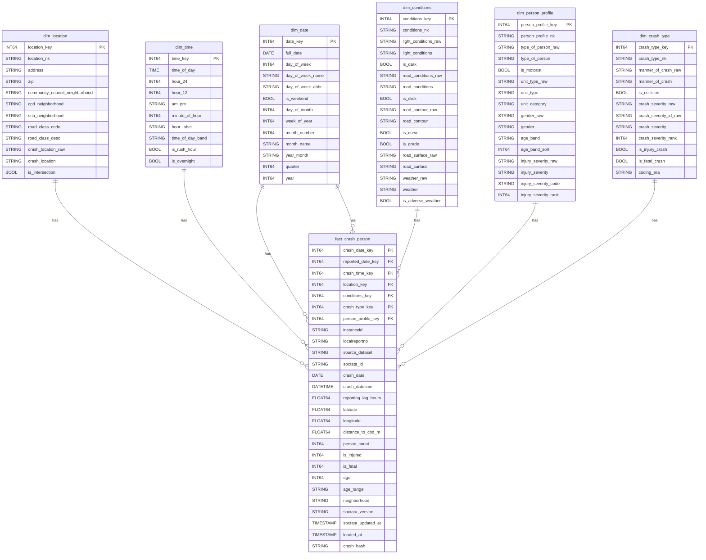

# Cincinnati crash star schema (BigQuery dataset: crashes)

Generated by `Build_ERD.py` from `Star_Schema_ETL.sql`. Do not edit.

```mermaid
erDiagram
dim_date {
 INT64 date_key PK
   DATE full_date 
   INT64 day_of_week 
   STRING day_of_week_name 
   STRING day_of_week_abbr 
   BOOL is_weekend 
   INT64 day_of_month 
   INT64 week_of_year 
   INT64 month_number 
   STRING month_name 
   STRING year_month 
   INT64 quarter 
   INT64 year 
}
dim_time {
 INT64 time_key PK
   TIME time_of_day 
   INT64 hour_24 
   INT64 hour_12 
   STRING am_pm 
   INT64 minute_of_hour 
   STRING hour_label 
   STRING time_of_day_band 
   BOOL is_rush_hour 
   BOOL is_overnight 
}
dim_location {
 INT64 location_key PK
   STRING location_nk 
   STRING address 
   STRING zip 
   STRING community_council_neighborhood 
   STRING cpd_neighborhood 
   STRING sna_neighborhood 
   STRING road_class_code 
   STRING road_class_desc 
   STRING crash_location_raw 
   STRING crash_location 
   BOOL is_intersection 
}
dim_conditions {
 INT64 conditions_key PK
   STRING conditions_nk 
   STRING light_conditions_raw 
   STRING light_conditions 
   BOOL is_dark 
   STRING road_conditions_raw 
   STRING road_conditions 
   BOOL is_slick 
   STRING road_contour_raw 
   STRING road_contour 
   BOOL is_curve 
   BOOL is_grade 
   STRING road_surface_raw 
   STRING road_surface 
   STRING weather_raw 
   STRING weather 
   BOOL is_adverse_weather 
}
dim_crash_type {
 INT64 crash_type_key PK
   STRING crash_type_nk 
   STRING manner_of_crash_raw 
   STRING manner_of_crash 
   BOOL is_collision 
   STRING crash_severity_raw 
   STRING crash_severity_id_raw 
   STRING crash_severity 
   INT64 crash_severity_rank 
   BOOL is_injury_crash 
   BOOL is_fatal_crash 
   STRING coding_era 
}
dim_person_profile {
 INT64 person_profile_key PK
   STRING person_profile_nk 
   STRING type_of_person_raw 
   STRING type_of_person 
   BOOL is_motorist 
   STRING unit_type_raw 
   STRING unit_type 
   STRING unit_category 
   STRING gender_raw 
   STRING gender 
   STRING age_band 
   INT64 age_band_sort 
   STRING injury_severity_raw 
   STRING injury_severity 
   STRING injury_severity_code 
   INT64 injury_severity_rank 
}
fact_crash_person {
 INT64 crash_date_key FK
   INT64 reported_date_key FK
   INT64 crash_time_key FK
   INT64 location_key FK
   INT64 conditions_key FK
   INT64 crash_type_key FK
   INT64 person_profile_key FK
   STRING instanceid 
   STRING localreportno 
   STRING source_dataset 
   STRING socrata_id 
   DATE crash_date 
   DATETIME crash_datetime 
   FLOAT64 reporting_lag_hours 
   FLOAT64 latitude 
   FLOAT64 longitude 
   FLOAT64 distance_to_cbd_m 
   INT64 person_count 
   INT64 is_injured 
   INT64 is_fatal 
   INT64 age 
   STRING age_range 
   STRING neighborhood 
   STRING socrata_version 
   TIMESTAMP socrata_updated_at 
   TIMESTAMP loaded_at 
   STRING crash_hash 
}
dim_location 1--0+ fact_crash_person : has
dim_time 1--0+ fact_crash_person : has
dim_date 1--0+ fact_crash_person : has
dim_conditions 1--0+ fact_crash_person : has
dim_date 1--0+ fact_crash_person : has
dim_person_profile 1--0+ fact_crash_person : has
dim_crash_type 1--0+ fact_crash_person : has
```
